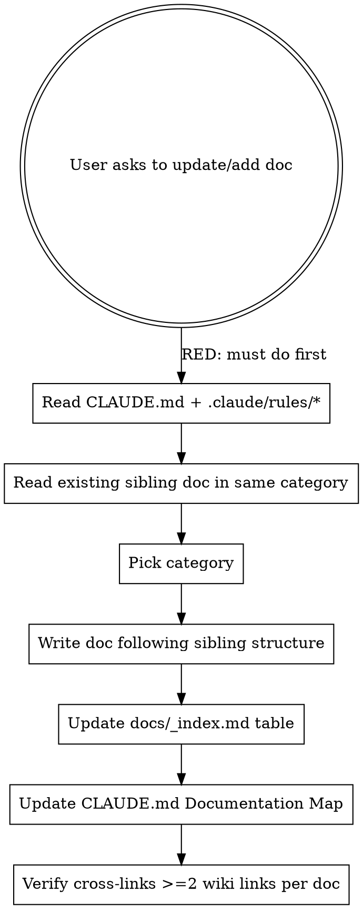

# Updating Docs

## Overview

This skill enforces the **read-first, write-second** discipline for documentation work. Stable rules live in `.claude/rules/`, an authoritative tree lives in `CLAUDE.md`, and the wiki-link convention only works if every doc follows the pattern. Skipping context before writing creates orphan docs that future agents cannot find.

**Core principle:** Future agents must be able to navigate this repo from docs alone. Every doc is a memory cell — a disconnected doc is a lost memory.

## When to Use

- User says "update docs", "document this", "อัพเดทเอกสาร", "เขียน doc", "เพิ่ม doc"
- Creating a new feature/architecture/reference/project/integration/build/testing doc
- Modifying an existing doc and unsure of structure
- Touching `CLAUDE.md` Documentation Map
- An agent is about to write in `docs/` and has not read `CLAUDE.md` in this session

**Do NOT use for:**
- Inline code comments (use language conventions instead)
- `CHANGELOG.md` entries (use Keep a Changelog format)
- Decisions log (`decisions.md` has its own format)
- This install-obsidian repo's own top-level files (README, INSTALL, PRINCIPLES, CONTRIBUTING, CHANGELOG, CLAUDE.md, decisions.md) — those follow a different convention and live in their own governance flow

## Required Pre-Reading (MUST do before writing)

**Iron Law: no doc written before these are read in this session.**

```bash
# 1. Project hub — has the directory tree and documentation map
Read CLAUDE.md

# 2. Stable rules — these are NON-NEGOTIABLE
Read .claude/rules/stable-rules.md
Read .claude/rules/coding-behavior-rules.md
Read .claude/rules/security-rules.md   # if doc touches auth/data/secrets

# 3. Existing sibling doc — match its style, not invent a new one
Read docs/_index.md                       # see where your doc will live
Read the closest existing doc in the same category
```

**If you skip these, your doc will contradict a stable rule within 5 lines. This is not paranoia — it has happened.**

## The Workflow



## Doc Category Decision

Where does this doc go? Match the existing repo's category set. The category that already has a similar doc is yours.

| Category | Path | When |
|----------|------|------|
| **Project** | `docs/project/` | Identity, stack, team roles — read first by every agent |
| **Feature workflow** | `docs/features/` | User-facing behavior, end-to-end business workflow |
| **Architecture** | `docs/architecture/` | Tech choices, schema, infra patterns, subsystem design |
| **Reference** | `docs/reference/` | Config, constants, conventions, design tokens |
| **Integration** | `docs/integrations/` | External tools, libraries, services |
| **Build** | `docs/build/` | Build, packaging, release |
| **Testing** | `docs/testing/` | Test strategy, conventions, fixtures |

**If unsure: read `docs/_index.md` table of contents. The category that already has a similar doc is yours. Do not create empty category folders — every room needs furniture.**

## Required Doc Structure

Match the template used by existing docs in this repo. A typical structure:

```markdown
# Title

> One-line description ending with period.

---

## Overview
What is this? 1-2 paragraphs.

## Context Snapshot
Bullets or table of the key facts a reader needs upfront.

## When to Read This
### Trigger
- Symptom or task that signals this doc applies.

### Read With
- `path/to/file.md` [[wiki-link]] — reason

## [Main content sections...]
- Use H2 for major sections, H3 for sub-sections.
- Include code blocks for non-trivial examples.
- Cross-link to related docs with `[[docs/path/file]]` syntax.

## Related
- [[docs/related-1]] — why it's related
- [[docs/related-2]] — why it's related
```

**Length guideline:** <500 words for most docs. If you need more, ask whether it should be split.

## The 6 Things You MUST Do (Checklist)

After writing the doc, verify ALL of these:

- [ ] **1. Wiki links**: Doc has >= 2 `[[docs/...]]` cross-links
- [ ] **2. `_index.md` updated**: New row added in the correct category table
- [ ] **3. `CLAUDE.md` Documentation Map updated**: New row added under the right heading
- [ ] **4. CLAUDE.md Task Routing updated** (if the doc adds a new "if you are working on X → read Y" path)
- [ ] **5. Language**: Match the repo's content language for user-facing examples, English for code/config (per stable rules)
- [ ] **6. No contradictions with `.claude/rules/stable-rules.md`**: Re-read stable rules before declaring done

**If any item unchecked, the doc is not done.** The user will assume you did all 6.

## Common Failures and Fixes

| Failure | Why it happens | Fix |
|---------|----------------|-----|
| Doc not findable from `_index.md` | Agent forgot index step | Always include the index update in your workflow — it is part of "the doc" |
| Doc contradicts a stable rule | Agent skipped pre-reading | Re-read rules — pre-reading is iron law, no exceptions |
| Doc uses raw path `docs/features/X.md` | Agent did not know wiki-link syntax | Use `[[docs/features/X]]` everywhere — Obsidian-compatible |
| Orphan doc, no related links | Agent stopped after writing the doc | Section "## Related" is mandatory, not optional |
| Doc explains things obvious from code | Agent over-explained | Match sibling doc depth; if sibling has 50 lines, yours should not have 500 |
| One doc per folder regardless of value | Agent over-applied category rule | Categories are rooms, not slots — skip empty rooms |
| Doc duplicates content from CLAUDE.md | Agent did not check the hub first | Link to CLAUDE.md instead of rewriting |
| Doc has 3 paragraphs of "history of how we got here" | Agent wrote narrative | Cut to Overview + Context Snapshot — narrative goes in commits |

## Red Flags — STOP and Restart

If you catch yourself doing any of these, delete the doc and start over:

- "I will add the cross-links later" — they will be forgotten
- "The user only asked for the doc, not the index" — index update is part of "the doc"
- "I already know the rules, no need to re-read" — that is exactly when you miss them
- "It is a small doc, does not need structure" — small docs benefit from structure MORE, not less
- "The doc is fine without Related section" — orphan docs are useless docs
- "I will just write it quickly, fix structure after" — you will never fix it after
- "This doc is unrelated to the rules" — every doc is downstream of stable rules
- "Skipping _index.md because it is just navigation" — navigation IS the point

**All of these mean: delete what you wrote, re-read the rules, and start over following the workflow.**

## Quick Reference: Wiki Link Syntax

```markdown
# GOOD — Obsidian-compatible, clickable in supported editors
[[docs/features/X]]
[[docs/reference/Y]]
[[CLAUDE]]

# BAD — raw path, not a link
[docs/features/X.md](docs/features/X.md)
docs/features/X.md
```

## Quick Reference: When to Read Which Rule

| Rule file | Read before docs that touch... |
|-----------|-------------------------------|
| `stable-rules.md` | Always |
| `coding-behavior-rules.md` | Docs about coding workflow, TDD, surgical changes |
| `security-rules.md` | Docs about auth, sessions, file uploads, secrets, admin routes |

## Real Example: Adding a New Feature Doc

**User:** "Document the new feature X"

**Step 1 — Read (RED phase):**
```bash
Read CLAUDE.md
Read .claude/rules/stable-rules.md
Read docs/_index.md
Read docs/features/closest-sibling.md
```

**Step 2 — Decide category:** Feature → `docs/features/X.md`

**Step 3 — Write** following the sibling's template.

**Step 4 — Update both maps:**
- `docs/_index.md` → add row in "Features" table
- `CLAUDE.md` → add row in Documentation Map "Features" section

**Step 5 — Cross-link:** `[[docs/features/closest-sibling]]`, `[[docs/architecture/tech-stack]]`

**Step 6 — Verify:** Run through the 6-item checklist above.

## Related

- [[CLAUDE]] — Project hub, has the directory tree and Documentation Map
- [[.claude/rules/stable-rules]] — Non-negotiable rules every doc must respect
- [[docs/_index]] — Documentation index you must update when adding a doc
- [[TEMPLATES/feature-doc]] — Example of a feature doc structure (in the installer repo)
- [[TEMPLATES/architecture-doc]] — Example of an architecture doc structure
- [[TEMPLATES/project-doc]] — Example of a project doc structure
- [[TEMPLATES/reference-doc]] — Example of a reference doc structure
